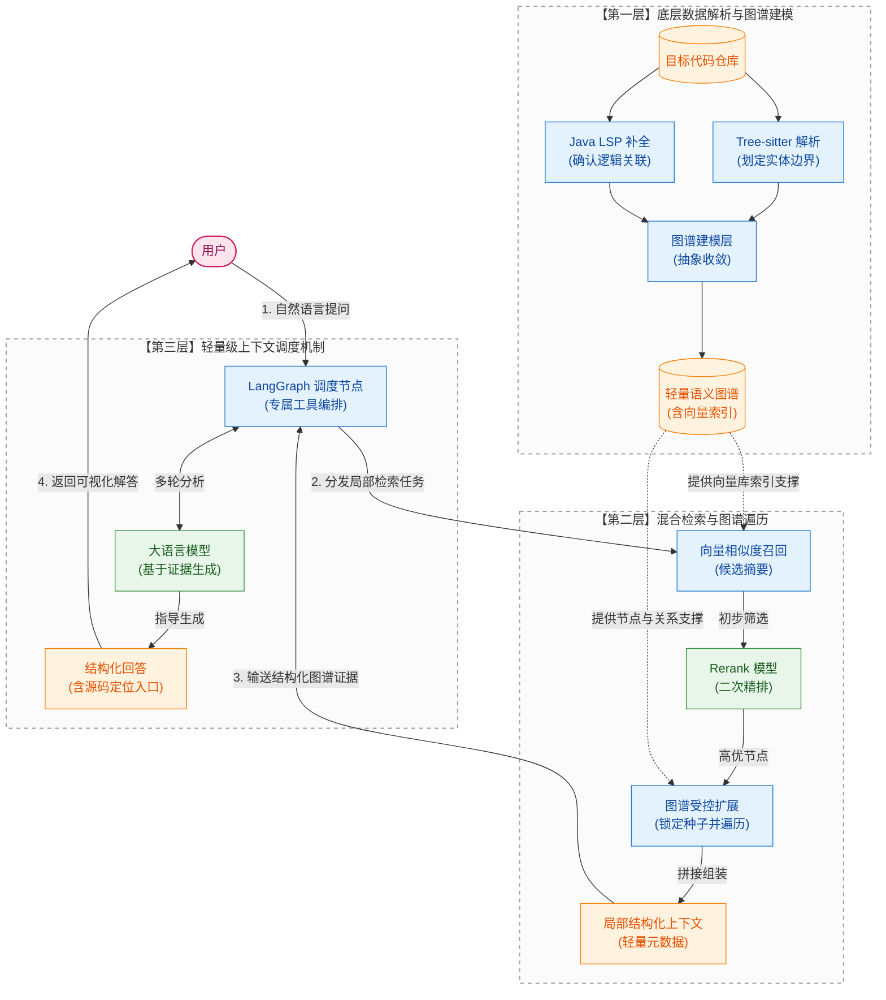
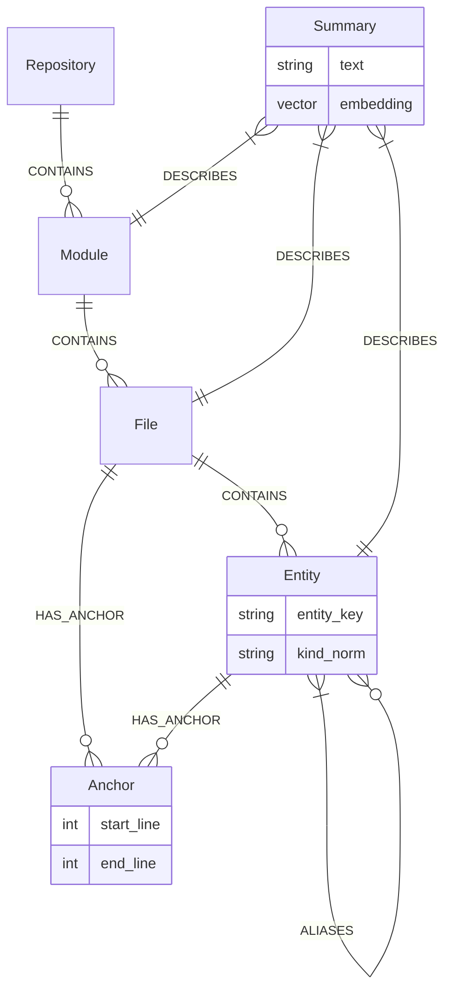
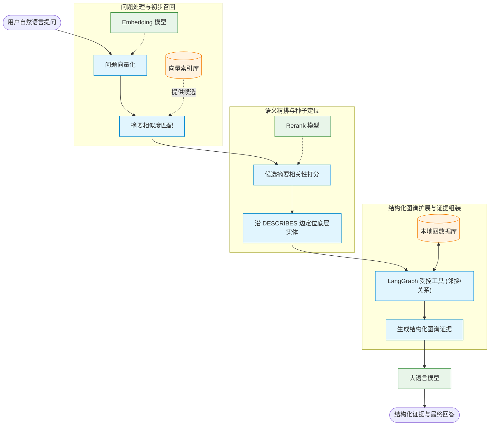
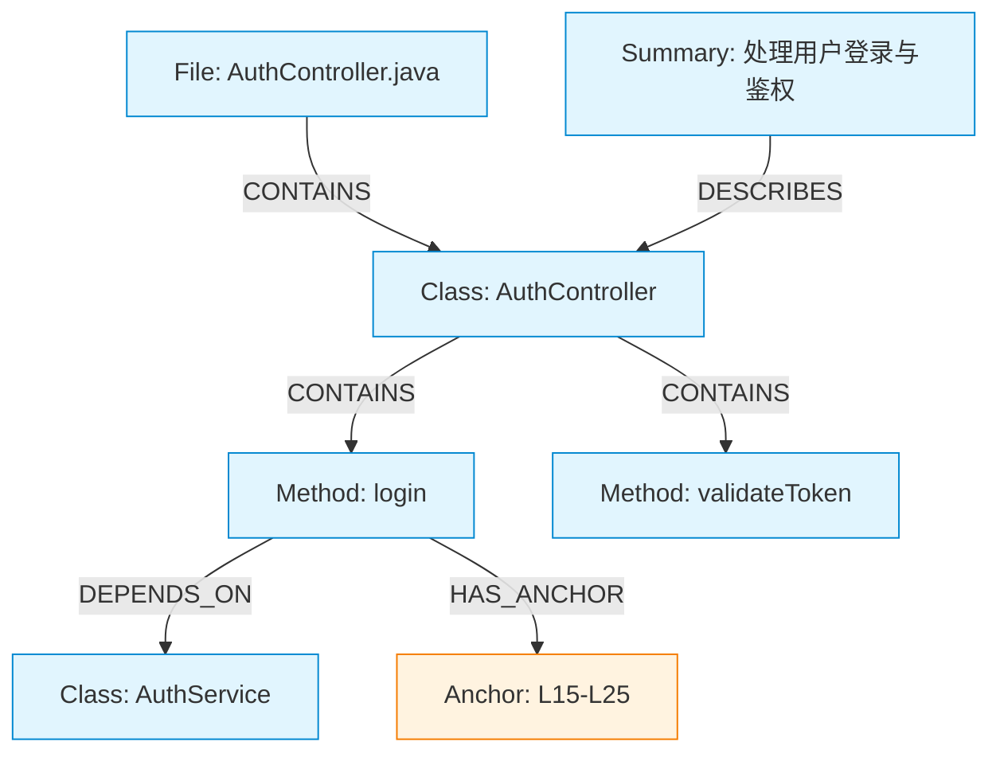
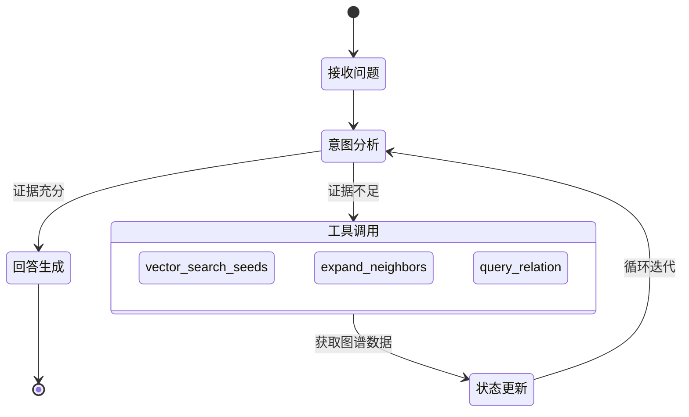

**目 录**

[第1章 作品概述](#作品概述)

[第2章 问题分析](#问题分析)

[2.1 问题来源](#问题来源)

[2.2 现有解决方案](#现有解决方案)

[2.3 本作品要解决的痛点问题](#本作品要解决的痛点问题)

[2.4 解决问题的思路](#解决问题的思路)

[第3章 技术方案](#技术方案)

[3.1 技术路线概述](#技术路线概述)

[3.2 系统总体架构](#系统总体架构)

[3.3 核心数据模型设计](#核心数据模型设计)

[3.4 关键技术选型方案](#关键技术选型方案)

[3.5 检索与上下文组织方案](#检索与上下文组织方案)

[3.6 可解释性与可靠性方案](#可解释性与可靠性方案)

[3.7 扩展性与应用场景方案](#扩展性与应用场景方案)

[第4章 系统实现](#系统实现)

[4.1 本地工作流实现](#本地工作流实现)

[4.2 代码结构解析实现](#代码结构解析实现)

[4.3 语义关系补全实现](#语义关系补全实现)

[4.4 图数据库持久化实现](#图数据库持久化实现)

[4.5 摘要与向量召回实现](#摘要与向量召回实现)

[4.6 上下文装配与源码懒加载实现](#上下文装配与源码懒加载实现)

[4.7 Web 可视化与 Agent 接入实现](#web-可视化与-agent-接入实现)

[第5章 测试分析](#测试分析)

[5.1 Web 对话功能正确性验证](#web-对话功能正确性验证)

[5.2 CLI 工具接口与 Agent 协同验证](#cli-工具接口与-agent-协同验证)

[5.3 与同类产品的对比测试](#与同类产品的对比测试)

[第6章 作品总结](#作品总结)

[6.1 作品特色与创新点](#作品特色与创新点)

[6.2 应用推广](#应用推广)

[6.3 作品展望](#作品展望)

[参考文献](#参考文献)

#

# 作品概述

随着大语言模型（LLM）与智能编程助手的普及，AI Agent 在辅助开发者理解、修改和维护代码方面发挥着日益重要的作用。然而，现有 AI 编程范式在处理中大型代码仓库时，仍普遍依赖离散的文本检索或大规模的上下文拼接。这种方式容易导致上下文窗口被冗余信息占据，进而削弱模型对关键问题的推理能力。同时，由于代码实体之间的调用、继承、依赖等关系没有被显式建模，模型生成的回答往往缺乏可验证的上下文依据。特别是在面向接口编程、模块边界清晰且依赖关系复杂的现代工程中，仅凭局部的文本特征难以准确还原系统真实的拓扑结构。近期关于仓库级代码图谱的研究也表明，显式维护 repository-level code graph 能够为 AI 软件工程任务提供更完整的结构导航与上下文线索[3]。

针对上述问题，本作品提出并实现了一种面向 Java 仓库的本地代码语义图谱构建与问答方案。系统通过 Tree-sitter 解析源代码中的文件、类、接口、方法、字段等实体，并结合 Java LSP 补全跨文件的依赖、继承和调用等深层关系，将原本扁平的代码仓库组织为结构化、可查询、可追溯的语义图谱[4-5]。

相较于传统的纯文本或向量片段检索技术，本作品的核心优势在于实现了从“文本片段匹配”到“结构化语义检索”的范式转变。系统将摘要向量作为自然语言查询的入口，以图谱关系作为上下文受控扩展的依据，并通过 Web 界面与 LangGraph 对话流程将结果直观地呈现给开发者。FalkorDB 的 CodeGraph 项目已展示了利用代码知识图谱分析依赖、定位瓶颈并通过 GraphRAG 支持代码问答的工程化路径[1]；该方案也可广泛应用于代码问答、架构理解和变更影响分析等工程场景。

# 问题分析

## 问题来源

随着软件系统规模的不断扩大，代码仓库中的文件数量日益增多，模块依赖与调用关系也变得愈发复杂。开发者在接手陌生项目或维护中大型系统时，往往需要耗费大量时间阅读源码、查找定义、追踪调用链路，以理清不同模块间的交互关系。尽管现有的大语言模型和智能编程助手已能根据给定的代码片段回答问题，但它们通常依赖于局部文本检索或简单的上下文拼接，难以从全局视角掌握整个仓库的结构信息。

在实际开发场景中，开发者经常会面临以下困境：

1)  代码上下文分散在众多文件中，人工跨文件查找的效率较低；

2)  大模型的上下文窗口有限，大量堆砌的代码片段会迅速耗尽输入空间，甚至导致模型推理能力退化；

3)  反复进行片段检索、上下文拼接与筛选分析，显著增加了系统的响应延迟；

4)  LLM 的回答时常缺乏明确的源码依据，导致开发者难以判断其是否真正理解了代码间的深层逻辑关系。

因此，亟需一种更具结构化、更强可追溯性的方式来组织和管理代码仓库信息，从而为 AI 辅助编程提供更可靠的上下文支持。

## 现有解决方案

当前，常见的代码理解手段主要包括人工阅读审查、IDE 静态分析、关键词检索、向量检索以及 AI 编程助手等。人工阅读结合 IDE 跳转适用于精确查看单个符号的定义与引用。但在面对跨模块、跨文件的复杂逻辑链时，开发者需要频繁切换文件，认知负担较重，整体理解成本偏高。关键词检索虽能快速定位文本，却无法有效揭示代码实体间的语义关联（如调用、继承、依赖和包含关系）。

部分 AI 编程工具采用“检索-拼接-生成”的范式，即先检索相关代码片段，再将其拼接至大模型上下文中生成回答。这种方式虽然便捷，但极易受限于上下文窗口大小、检索准确率以及代码片段的完整性。在处理大型仓库时，系统需要在海量文件中反复搜索和筛选，耗时显著增加；同时，模型接收到的多为离散的代码片段，缺乏结构化的关系信息，导致生成的回答往往依据模糊。近期，一些工具和研究开始尝试结合代码搜索、符号索引或代码图来增强上下文能力，这表明代码的结构化理解正逐渐成为 AI 编程工具发展的重要趋势[1,3]。

在这一技术演进过程中，具备自主规划与执行能力的智能体（Agent）开始崭露头角。在现代人工智能语境下，Agent 是指能够感知环境、进行自主推理决策并采取行动的软件实体。与依赖预设指令的程序不同，它以大语言模型作为逻辑判断中枢，突破了单纯的文本生成范畴，能够自主进行任务拆解并调用外部工具与环境交互。其在软件工程垂直领域的深度应用即为“编码智能体（Coding Agent）”。编码 Agent 继承了上述推理能力，并被赋予了文件读写、语法解析等专业开发工具，使其能够自主穿梭探索本地代码仓库上下文，制定修改策略并验证执行，以“数字协作开发者”的身份深度融入研发流程。

近年来，以 Cursor、Augment 为代表的编码 Agent 开始引入了项目级别的代码库索引能力。例如，Cursor 通过对代码库建立索引，将源码按函数、类或逻辑块进行切分并生成向量，以此支持语义搜索；Augment 也着重强调通过专用的上下文引擎来理解大型代码库乃至多仓库项目，不过其具体实现机制尚未公开。在实际应用中，这类工具确实较好地缓解了传统 AI 助手只能依赖当前打开文件或需要手动粘贴上下文的局限。然而，它们大多为闭源商业产品，核心的索引机制与上下文调度策略并不透明，且完整功能通常需要付费订阅。对于学生、个人开发者或是希望本地部署以保证数据安全的团队而言，其使用成本和可控性仍是明显的限制因素。

另一方面，众多开源的编码 Agent 也提供了类似的代码库索引功能。例如，Kilo Code 等工具支持利用 Tree-sitter 将代码切分为独立的块，生成向量（Embedding）后存入 Qdrant 等向量数据库，进而在用户提问时通过语义相似度召回相关的代码片段。这类开源方案的使用门槛相对较低，适合个人试用探索。但其索引机制通常仍局限于“代码块向量化”，本质上是将打碎的代码片段存入数据库，再基于文本的相似度进行召回。这种方式虽然能找到字面或语义相近的代码，但在表达代码实体间的深层结构关系上显得力不从心。诸如“某个方法被哪些其他方法调用”、“某个类继承自哪个父类”、“某个模块具体依赖了哪些外部实体”等结构化信息，都无法通过单纯的向量检索得到自然且完整的呈现。

综上所述，现有方案主要存在两方面不足：一是闭源 AI IDE 虽然体验较好，但成本高昂、机制黑盒且难以灵活定制；二是开源工具虽然成本较低，但其索引粒度和结构化能力较为粗糙，过度依赖代码片段的向量检索，缺乏对代码深层语义关系的显式建模。相较之下，本作品致力于通过构建代码语义图谱，将代码仓库中的各类实体及其关联关系以结构化的形式保存下来。这使得系统在检索时不仅能定位相关的代码片段，更能清晰地还原代码间的层级、依赖、调用和继承结构，从而为后续的 AI Agent 提供一个更加坚实、可靠且具备强可解释性的上下文基础。CodeGraph 的工作表明，将图结构问题显式编码为可执行逻辑能有效提升推理的可控性[2]——本作品将这一思路延伸至代码理解领域，以结构化图谱约束大语言模型的生成过程。RepoGraph 则进一步从软件工程角度证明仓库级代码图可作为 AI 软件工程系统的导航结构[3]，二者共同支撑了本作品对结构化图谱上下文的设计取向。

## 本作品要解决的痛点问题

基于上述分析，本作品旨在重点解决 AI 辅助代码理解中存在的三个核心痛点：

1)  **代码语义拓扑结构的表征不足**：传统基于相似度的文本检索机制，难以稳定、精准地捕获跨文件、跨模块的显式关联（如接口实现、继承层次、类型依赖及方法调用等），致使模型对全局工程结构的认知往往停留在碎片化的片段层面。

2)  **上下文资源开销与信噪比失衡**：在处理大型代码库时，机械地将召回的代码块填充至提示词中，极易引入大量与当前问题弱相关的噪声信息。这不仅会消耗有限的上下文窗口资源，还会增加模型的推理延迟，并降低输出结果的稳定性。

3)  **生成结果的可解释性匮乏**：当模型的回答缺乏明确的实体指向、关系推演路径以及具体的源码位置依据时，开发者很难判断其是否真正理解了底层的代码逻辑，更难以在严谨的工程实践中对其结论进行复核。

## 解决问题的思路

1)  **引入“代码图谱化”重构信息组织形式**：为克服单纯文本检索难以表达跨文件关系的缺陷，本系统引入了“代码图谱化”思路。系统通过静态解析与语义补全，将松散的文本代码库抽象为一个由文件、类、方法等实体作为节点，以包含、依赖、实现等语义关联作为边构成的结构化图谱。借此，原本隐式的代码逻辑链路被显式地转化为可查询、可遍历的图数据。该设计与 FalkorDB CodeGraph 对“代码库知识图谱可用于依赖分析、瓶颈检测和代码问答”的定位保持一致[1]。

2)  **采用“摘要入口-图谱扩展-重排筛选”的混合检索策略**：为减少大语言模型直接阅读海量源码造成的上下文浪费，系统设计了全新的检索工作流。系统预先为模块、文件和实体生成文本摘要并建立向量索引；当接收到自然语言查询时，后端优先通过向量检索召回候选的种子节点，再结合 Rerank 模型筛选出相关性更高的候选，最后以此为起点沿图谱边进行受控扩展，从而显著提升上下文的相关性与可解释性。

3)  **基于受控工具编排强化回答的可解释性**：针对模型易产生无依据回答的问题，本系统在对话生成链路中引入了基于 LangGraph 的受控工具编排机制。状态机会引导模型按需调用种子检索、邻接扩展和关系查询等图谱工具，并将获取到的结构化信息（如摘要、节点属性、关系类型及源码锚点）作为证据输入给生成阶段。LangGraph 官方文档将其定位为用于构建长期运行、有状态 Agent 的低层编排框架，适合以状态、节点和边组织多步工具调用流程[7]。这种机制使回答过程能够严格围绕图谱证据展开，有效降低了无来源推断的比例。

# 技术方案

## 技术路线概述

针对传统 AI 编程工具在处理中大型代码仓库时面临的上下文开销大、检索结果碎片化及调用链路断裂等局限，本项目提出了一种面向本地部署的低开销、可追溯且具备高可解释性的代码理解架构。该架构采用融合了结构化语义图谱、摘要向量召回、Rerank 重排以及 LangGraph 工具编排的处理机制，避免直接向大模型输入大量原始源码片段。

在整体技术链路上，系统主要分为图谱构建、摘要索引和对话检索三个阶段。在图谱构建阶段，系统对本地 Java 仓库进行静态解析提取代码实体，并借助 Java LSP 补全依赖、继承等深层关系。在摘要索引阶段，系统生成文本摘要并建立向量索引。在对话检索阶段，系统基于用户问题召回摘要节点，经 Rerank 重排后定位种子实体，随后通过受控的图谱工具扩展上下文关系，最终生成带有结构化证据的回答。

## 系统总体架构

**图 3-1 系统总体架构图**

如图 3-1 所示，本系统的整体架构遵循自底向上的分层设计理念：

1)  **底层数据解析与图谱建模**：针对目标代码仓库，系统融合了 Tree-sitter 与 Java LSP 的双引擎解析机制，分别负责划定代码实体边界与确认跨文件的逻辑关联。图谱建模层将解析结果统一收敛为不同抽象层级的核心节点，构建出轻量级的代码语义图谱。

2)  **混合检索与图谱遍历**：系统生成关键代码节点的自然语言摘要并建立向量索引。接收到自然语言提问时，检索层先通过向量相似度召回候选的摘要节点，再利用 Rerank 模型进行相关性二次精排。锁定种子节点后，系统会沿图谱的各类语义边进行受控扩展，拼接出与问题相关的局部结构化上下文。

3)  **轻量级上下文调度机制**：系统对外优先输出摘要文本、节点属性、关系方向、边类型、源码路径及锚点坐标等轻量级的元数据信息。对话链路中的 LangGraph 节点通过调用专属工具，将这些结构化的元数据作为证据指导大模型生成最终回答。这种策略不仅有效规避了注入大量无关源码的风险，也为开发者后续的代码定位和人工校验保留了准确的入口。

## 核心数据模型设计

**图 3-2 代码语义图谱核心数据模型实体关系图**

如图 3-2 所示，数据模型是整个技术方案的基石。本系统将代码仓库抽象为“仓库-模块-文件-实体-锚点-摘要”的层级结构，既保留了代码在物理文件中的位置，又凸显了类、接口、方法、字段等语义实体在代码理解中的核心地位。与直接保存整段源码的做法不同，本方案实现了源码内容与图谱元数据的解耦：图谱层负责刻画实体身份、层级归属、语义关联以及源码坐标；而原始的源码文本，则在确有需要时依据锚点坐标进行动态加载。这种设计避免了图数据库因承载大量冗余文本而变得臃肿，同时保证了任何检索结果都能精准回溯到原始文件的具体代码行。

在关系设计上，系统采用了一套收敛的关系族，而非无限扩展的细粒度边类型。这些核心边统一表达了从宏观架构到微观实体的层次结构、代码实体间的依赖或调用关联、面向对象的继承与实现语义，以及将抽象节点绑定至源代码坐标的映射关系等。这套收敛的关系体系使图谱能够覆盖绝大部分代码分析场景，同时维持了底层查询模型的稳定，避免了图结构过度复杂。

## 关键技术选型方案

在代码结构解析层，方案采用了 Tree-sitter 与语言服务器协议（LSP）优势互补的技术路线。Tree-sitter 是面向源码的解析器生成工具和增量解析库，能够构建并维护源码的语法树[4]，为实体抽取和源码锚点划定提供可靠边界；而 LSP 则规范了 `textDocument/definition`、`textDocument/references` 等语言能力请求[5]，可借助项目级编译上下文精准补充跨文件定义跳转、引用查找及深层次的语义结构。二者协同作战，使得系统既摆脱了对纯文本规则推断的依赖，又在准确度、系统性能及工程落地可行性之间取得了平衡。

在图谱存储层，方案选择了具备原生图查询能力的本地图数据库作为存储介质。代码理解任务天然需要执行路径遍历、邻接关系扩展和子图裁剪，图数据库能够直观地表达并处理这类关系型网络结构，避免了在传统关系型数据库中频繁进行复杂的表关联（JOIN）运算。FalkorDB 官方文档说明其采用属性图模型、支持 OpenCypher，并提供全文搜索、向量相似度和范围索引等查询能力[6]。对于本地演示和开发调试场景，轻量化的图数据库极大降低了部署门槛；未来在生产级应用中，该图模型也能平滑迁移至更完善的分布式图数据库服务。

在语义入口层，方案引入了摘要结合向量索引的机制，作为自然语言查询与代码图谱之间的桥梁。摘要节点主要作为面向检索的高层次聚合语义入口，与底层源码形成互补。当系统接收到用户的自然语言查询时，能够借助摘要节点迅速在代码库中筛选出相关的模块、文件或实体。这不仅发挥了向量检索在模糊意图匹配上的优势，又通过图谱的拓扑关系对召回结果施加了结构化约束，避免了检索结果沦为缺乏上下文逻辑的孤立片段。

## 检索与上下文组织方案

在深入介绍具体的检索流程之前，有必要简要阐明本方案所依赖的两个核心信息检索概念：**向量检索（Vector Retrieval）**与**重排（Rerank）**。

- **向量检索**：其核心机制是将非结构化文本（如代码摘要、自然语言提问）通过嵌入（Embedding）模型映射为高维空间中的数值向量。通过计算向量之间的空间距离（如余弦相似度），系统能够发现字面特征不同但深层语义相近的内容，从而实现跨越传统关键词匹配的模糊语义召回。这种方式召回效率高、覆盖面广，但由于文本特征被压缩至固定维度，在处理细粒度逻辑时可能会引入部分相关性不高的噪声数据。
- **重排（Rerank）**：为弥补向量检索在精度上的局限，重排机制通常在初步召回一批候选结果后介入。重排模型利用深度神经网络（如基于注意力的交叉编码器），将原始查询与每一条候选文本进行细致的联合语义分析。依据模型计算出的精确相关性得分对候选集进行二次排序，系统能够有效剔除误召回的噪声，将相关性最高的结果推至前列，从而显著提升最终交付给大语言模型的上下文质量。

**图 3-3 检索与上下文组织工作流程图**

如图 3-3 所示，基于上述原理，系统在检索流程上规划了“问题向量化—摘要召回—候选重排—种子定位—图谱扩展—证据生成”的分阶段方案。流程中，用户输入的问题首先被映射为向量，并与索引库中的摘要向量进行相似度匹配，召回一批候选 Summary 节点；随后，Rerank 模型对候选摘要与原始查询进行相关性二次精排，筛选出高相关性的摘要节点；接着，系统顺着 DESCRIBES 边将精排后的摘要节点定位至底层的核心实体或文件节点，确定种子；最后，LangGraph 工具围绕这些种子节点，按需执行图谱邻接关系扩展或查询，最终输出结构化的证据供生成阶段使用。

这套上下文组织方案的核心在于向模型提供具备逻辑支撑和高信息密度的结构化上下文，而非一次性输入大量源码。面对“某个核心方法被谁调用”、“修改底层接口会影响哪些实现类”等问题，系统能够优先梳理出完整的关系链路和候选实体名单。只有在需要进一步探究底层细节时，系统才会根据线索加载关键的局部代码。与直接使用离散代码片段的传统做法相比，该方案大幅降低了噪声上下文的干扰，确保模型在生成回答时具备明确的逻辑推演依据。

## 可解释性与可靠性方案

为了降低模型在代码问答中产生“幻觉”的风险，本方案将“打造可追溯的证据链”确立为核心设计目标。系统为代码实体绑定了不可篡改的源码锚点坐标，并在维系实体关系的边上记录了多维度的度量属性。检索输出的结果不仅包含自然语言描述，更包含可被独立验证的实体标识与证据来源。后续的大模型生成阶段必须基于这些严谨的证据来组织回答，同时开发者也能够随时依据锚点跳转至原始代码位置进行交叉复核。

在保障系统可靠性方面，方案引入了增量感知与缓存友好的图谱管理思路。系统通过建立多层级的哈希与状态校验机制，快速判断代码文件或实体的局部变更，并精准评估已有索引是否因代码更新而失效。这套增量机制使得系统在面对日常小规模代码变更时，能够以极低的资源消耗执行快速的增量更新，彻底避免了频繁全量重建图谱的高昂代价。

## 扩展性与应用场景方案

本作品的技术方案虽初期以 Java 仓库为验证对象，但其底层的抽象建模理念具备跨语言的普适性。只要新引入的编程语言解析器能够产出符合规范的实体、关系、锚点及摘要数据，即可无缝接入当前这套成熟的图谱模型与检索流程。因此，该方案具备向 Python、TypeScript、Go 等主流语言生态扩展的坚实基础，也非常适合应用于多技术栈混杂的大型混合代码仓库。

从应用层来看，本方案的潜能不仅局限于代码问答，它具备向更深层次软件工程管理场景拓展的空间。例如，可集成进代码审查（Code Review）流程辅助排查问题；在重构历史系统时，评估变更的波及范围与风险；或是帮助新入职的开发者快速理清项目架构，加速上手过程。这些场景的共同诉求都在于：能够在海量代码中精准定位焦点实体、洞察实体间的隐秘关联，并将分析结论严格回溯至真实的源码片段。通过将静态的代码仓库转化为高鲜活性、高可解释性的结构化语义图谱，本作品为 AI 深度辅助软件工程提供了一种更为稳健和可落地的上下文管理范式。

# 系统实现

本章从系统当前的完成形态出发，详细描述系统内部的实现细节。系统整体围绕“本地仓库快速初始化、结构化代码图谱构建、文本摘要与语义向量检索、Rerank 候选重排、基于 LangGraph 的受控工具问答、Web 可视化交互展示”的核心链路展开。系统首先将代码库构建为结构化、可查询、可追溯的语义图谱，避免简单地将源码切块后直接输入给大模型；随后再将检索提炼出的关键信息，编排为模型和开发者都能理解的“结构化证据上下文”。

在各功能模块的具体实现中，数据的提取、关联与流转均严格遵循一套统一的实体关系（ER）模型。为了便于理解后续各模块的数据处理逻辑，在此先将系统实现的底层核心图谱结构（涵盖节点类型与关系类型）列出。

**表 1 系统实现中的图谱节点结构**

| 节点类型 | 核心属性 | 作用/说明 |
| :--- | :--- | :--- |
| **Repository** (代码库) | `repo_id`, `name` | 唯一标识与名称，代表整个代码库。 |
| **Module** (模块) | `module_id`, `name`, `root_path`, `ecosystem`, `zone` | 单体仓库的物理或逻辑边界（如 `prod`, `test` 等区域划分）。 |
| **File** (文件) | `file_id`, `relative_path`, `language`, `zone`, `content_hash`, `position_encoding` | 承载文档级别的操作，作为一等公民节点。 |
| **Entity** (语义实体) | `entity_id`, `entity_key`, `display_name`, `qualified_name`, `kind_norm`, `kind_raw`, `origin`, `semantic_hash` | 图的真正语义中心，涵盖类、函数、接口、枚举、全局变量、路由等。 |
| **Anchor** (位置锚点) | `anchor_id`, `start_line`, `start_col`, `end_line`, `end_col`, `role` | 记录代码的具体物理范围，不保存源码文本。 |
| **Summary** (摘要) | `summary_id`, `text`, `purpose`, `source_hash`, `summary_model`, `embedding_model`, `embedding_dimensions`, `embedding` | 向量检索的入口，将生成的自然语言摘要及向量挂载到图结构上。 |

**表 2 系统实现中的图谱关系结构**

| 关系类型 | 连接路径 | 关键属性 | 作用/说明 |
| :--- | :--- | :--- | :--- |
| **`CONTAINS`** (包含关系) | `Repository -> Module -> File -> Entity -> Nested-Entity` | - | 表达所有层级物理与逻辑包含结构。 |
| **`DEPENDS_ON`** (依赖关系) | `Entity -> Entity` | `kind`, `provenance`, `confidence` | 覆盖绝大部分的代码语义使用场景（如 calls, imports 等）。 |
| **`SPECIALIZES`** (特化/派生关系) | `Entity -> Entity` | `kind`, `provenance`, `confidence` | 处理面向对象中的继承、接口实现、重写（Override）等。 |
| **`ALIASES`** (别名关系) | `Entity -> Entity` | - | 处理重导出、导入别名或生成的镜像代码（同一个语义对象的不同包装）。 |
| **`HAS_ANCHOR`** (关联锚点) | `Entity -> Anchor`, `File -> Anchor` | `role` | 连接语义节点与其在源代码中的确切物理位置。 |
| **`DESCRIBES`** (描述关系) | `Summary -> Entity \| File \| Module` | - | 将生成的自然语言摘要及向量挂载到对应的实体、文件或模块上。 |

## 本地工作流实现

为降低使用门槛并提供良好的开发者体验，系统设计了一套统一且简洁的本地命令行交互界面（CLI）。用户在目标代码仓库根目录下执行初始化命令后，系统会在后台自动创建专属的工作空间目录 `.rigel`。该目录承载系统运行所需的全部本地状态，并会自动生成默认的全局配置文件（如图 4-1 所示）。配置文件采用模块化设计，清晰划分为六大核心版块：负责 Web 服务参数的 `web`、管控本地图数据库参数的 `graphrag`、调度对话生成模型的 `chat`、配置摘要生成模型的 `summary`、设定向量化模型的 `embedding`，以及管理重排模型的 `rerank`。这种高度解耦的配置机制，使得用户可以针对不同硬件条件和模型厂商进行灵活适配。全量索引构建完成后，系统会将运行状态记录写入索引状态文件，并持久化保存 FalkorDBLite 本地图数据库文件。这为后续的 CLI 问答调用或 Web 可视化展示提供了统一且状态一致的运行基座。

\[待插入图：配置文件截图\]
**图 4-1 配置文件截图**

在核心的索引构建工作流方面，命令引擎以当前执行目录作为目标 Repository 的物理边界，启动递归扫描程序。解析器内置了对 Java 生态的深度兼容，能够自动识别 Maven、Gradle 等常见构建工具的目录规范，并通过预设的路径匹配规则，精准区分出生产代码、测试代码、工具脚本、第三方依赖以及框架自动生成的代码。系统支持全量与增量两种索引模式。全量构建会从零初始化并重建本地图数据库，奠定基础图谱；增量索引则通过提取并对比底层数据库中既有文件的内容哈希指纹，智能识别出新增、修改、删除及未变动的文件集合。增量模式下，系统仅需清理失效的文件子图，并重新解析、写入发生变更的局部代码图谱。最后，系统将详尽的运行统计数据、耗时指标与更新日志固化至状态文件中。这不仅极大缩短了日常开发迭代时的解析等待时间，也为后续的 CLI 问答调用或 Web 端可视化呈现提供了一个高度可靠、状态一致的运行基座。

## 代码结构解析实现

代码结构解析模块构成了构建高质量语义图谱的第一道工序，其核心以 Tree-sitter 高效生成的抽象语法树（AST）作为初始输入。系统首先为每个被扫描到的源码文件创建一个 File 节点，作为图谱中的一等公民。该节点不仅记录文件的相对路径和语言类型，还保存了其所属的逻辑分区（如 `prod` 或 `test`）、文件内容哈希值以及坐标编码方式等关键元数据。随后，解析引擎深入遍历语法树，精准提取出类（Class）、接口（Interface）、枚举（Enum）、记录（Record）、方法（Method）、构造函数（Constructor）、注解元素（Annotation Element）及字段（Field）等构成业务逻辑的核心语义实体，并将其转化为图谱中的 Entity 节点。每个 Entity 节点均封装了丰富的信息，包括便于前端呈现的展示名、全限定名、标准化后的抽象类型、原始语言语法类型、代码来源标记，以及基于实体签名与代码主体内容计算得到的语义哈希。该语义哈希会忽略空白和注释变化，用于控制摘要缓存的精准失效。

在保障图谱一致性的全局唯一身份标识（ID）设计上，系统采用了一套极为严密的算法机制。为了生成稳定的 `entity_key`，算法不仅采集实体的命名空间（如包名、类名），还综合了父层类型名称、成员变量名以及方法参数的完整类型签名等深层特征。在此基础上，系统进一步将文件本身的物理身份标识融合进最终的 `entity_id` 计算之中。这一多维度混合哈希策略有效地化解了多种棘手场景，例如同名重载方法（Overloaded Methods）的精准区分、深度嵌套类（Nested Classes）的层级隔离，以及由于不同文件定义了相同名称类型而引发的 ID 冲突问题。针对诸如 `int a, b;` 这种多个变量共享同一 AST 声明节点的语法简写，系统会在解析阶段将其强制展开，拆解为彼此独立的字段实体。此举旨在确保后续的依赖追踪和源码定位过程颗粒度足够细致且准确无误。

此外，为了实现逻辑图谱与物理源码的高效解耦，系统专门设计了 Anchor（锚点）节点机制。系统为每一个 File 节点及其下属的所有 Entity 节点，分别生成专属的位置锚点，详细记录实体名称声明区域、完整定义边界区域以及内部代码主体区域在原始源文件中的起始与终止行列坐标。Anchor 节点通过 `HAS_ANCHOR` 有向边与其对应的属主节点紧密相连。这种设计避免了将大段冗长、易变的源码文本直接塞入图数据库的属性字段中，从而大幅减轻了数据库的存储压力。更重要的是，在检索匹配阶段，系统只需输出轻量级的坐标元数据，即可确保最终的检索结果能够通过文件系统精准、快速地回溯至编辑器中的具体代码行。

## 语义关系补全实现

在基础的实体及文件拓扑构建完毕后，系统进入动态语义关系补全阶段。传统静态分析往往受限于跨文件解析能力，而本方案采用 Tree-sitter 与 Java 语言服务器协议（LSP）协同的双引擎机制。系统首先利用 Tree-sitter 在局部语法树中快速扫描，捕捉所有包含导入声明、外部类型引用、方法调用以及继承与实现声明等潜在关联的代码位置。随后，LSP 引擎利用全局项目编译上下文，对上述初筛出的潜在语法位置进行深度语义审查。系统设定了严格的入库准则：只有通过 LSP 的定义跳转（Go to Definition）或引用查询（Find References）等机制验证，并明确指向跨文件或本文件其他实体的关联，才会被正式写入持久化图谱[5]。这一校验环节从根本上剔除了单纯依赖字符串正则匹配所带来的大量误报与无效链路。

在将验证后的关联关系写入数据库时，系统严格贯彻了收敛的关系类型设计原则，避免边类型泛滥导致查询模型失控。所有表示包含、隶属的物理及逻辑层级结构，统一归类为 `CONTAINS` 有向边；诸如方法调用、外部类型引用、对象实例化等常规逻辑依赖，被集中映射为 `DEPENDS_ON` 关系；而面向对象编程中特有的类继承、接口实现及方法重写等深层衍生结构，则被抽象归纳为 `SPECIALIZES` 关系。对于通过别名导入、重导出，或由代码生成器生成的同名镜像实体，系统一律使用 `ALIASES` 边进行连接。为了在收敛的大类下保留必要的细节，系统会在生成的边上附加 `kind`（如具体调用类型）、`provenance`（来源渠道）以及 `confidence`（确信度）等属性标签。这种张弛有度的设计，既保证了顶层图查询语言（如 Cypher）的简洁高效，又为后续深挖特定调用链路提供了充足的线索数据。

针对特定的复杂工程场景，关系补全模块实施了针对性的优化策略。在处理方法覆盖（Method Override）时，系统并不止步于建立类与类之间的继承连线，更会在交叉校验父子类方法签名的一致性后，直接在子类的重写方法与父类的被重写方法之间建立直接的 `SPECIALIZES` 关联。这一设计极大地简化了诸如“修改父类底层接口会波及哪些具体子类实现”这类复杂影响范围追踪问题的解答难度。同时，面对大量由注解处理器或框架自动生成的样板代码，系统能够敏锐地识别这些与手写实体全限定名高度一致的镜像节点。系统会为它们建立 `ALIASES` 边并注入特定标记，从而在后续的 Rerank 过滤及模型检索匹配阶段，赋予由开发者人工维护的源代码实体更高的置信度权重，有效阻断机器生成的冗余代码对检索结果的干扰。

## 图数据库持久化实现

**图 4-2 图数据库可视化节点关联效果图**

如图 4-2 所示，图谱持久化模块承担着将内存中解析完毕的逻辑网络安全、高效地固化至本地 FalkorDBLite 图数据库的核心职责。在执行入库写操作时，系统架构层强制实施了“先写入独立节点，后拉起关系连线”的严格顺序规则。这一事务性保障机制从根本上杜绝了因目标节点尚未入库即创建关联，进而导致图库中出现大量悬空边，最终引发数据库内部引用完整性校验崩溃的工程隐患。在节点标记方面，系统为所有入库的实体统一赋予基础的 `RigelNode` 全局标签，并根据实体的具体语法种类附加 `Class`、`Method` 等细分标签。为了应对反复中断与重试等复杂运行环境，系统摒弃了简单粗暴的全量覆盖插入模式，转而全面采用基于实体稳定 ID 的 `MERGE` 条件合并写入指令。该策略确保了图谱构建的绝对幂等性，哪怕针对同一份源码库执行多次全量解析，数据库内也绝不会衍生出任何冗余重复的游离节点或多余关联连线。

为了极限优化本地开发环境下的调试响应速度与计算资源消耗，持久化模块还内置了一套高灵敏度的增量索引工作流。当用户触发更新时，增量引擎会迅速提取当前图数据库中存储的历史文件内容哈希指纹，并与当前文件系统实时计算出的最新哈希集进行比对。通过集合差异运算，引擎能够精准锁定新增、被修改、已删除以及保持不变的四个文件子集。针对已删除或发生实质性变更的文件，系统会精准执行图谱修剪操作，级联清理其直接关联的局部子图、专属的锚点坐标节点以及高维摘要节点。随后，针对新增和存活的被修改文件，系统仅针对这部分增量数据重新唤起完整的解析、补全与摘要生成流水线，并将这部分新鲜生成的图谱无缝拼接回主干网络中。这种轻量级的增量机制，将日常高频的小规模局部代码变更分析耗时从分钟级压缩至秒级，彻底打通了代码编写与图谱同步之间的流畅闭环。

## 摘要与向量召回实现

为了跨越结构化代码图谱与用户自然语言提问之间的巨大语义鸿沟，系统精心设计了 Summary 摘要节点机制，以此作为对接人类意图与底层冰冷代码的桥梁。系统针对 Module、File 以及高价值的 Entity 核心节点，专门生成了高度浓缩的摘要节点。该生成流水线运作严密：首先，提取模块组件或实体节点的核心多维特征，包括其在图谱中的身份角色、公开展示名称、在工程目录中的物理路径、全局唯一的限定名，以及它与周边节点的局部拓扑调用关系。这些结构化元数据被组装拼接为特定的提示词模板。随后，系统调用背后的大型语言模型（LLM），将这些模板信息转化为流畅、凝练的自然语言业务功能描述。紧接着，系统依托文本嵌入（Embedding）模型，将这段自然语言描述映射为极具表征能力的高维连续向量。最终，生成的向量数据与摘要文本被一并封存于 Summary 节点内，并通过专门的 `DESCRIBES` 有向边，将其紧密锚定在对应的底层目标实体上。这一整套机制，成功打通了从模糊的自然语言指令直达微观代码实体的检索快车道。

为了提升检索响应速度，系统集成了 FalkorDB 原生的向量近似最近邻（ANN）检索功能，并为 Summary 节点中的高维向量字段建立了专属索引。当开发者在交互面板输入自然语言查询时，后端引擎会快速将该问题转化为同等维度的查询向量，并在摘要索引库中召回一批在语义空间距离上最为接近的候选 Summary 节点，随后沿着 `DESCRIBES` 边精确锁定至图谱深处的真实代码“种子节点”。FalkorDB 文档明确列出了向量相似度搜索与 GraphRAG 能力，这为图遍历和语义检索的混合使用提供了基础设施支撑[6]。

然而，纯粹依赖向量距离的 ANN 召回算法在处理逻辑严密的代码检索时，容易因关键词的字面相似性而引入伪相关噪声。为突破这一瓶颈并提升检索信噪比，系统在召回链路的末端接入了兼容 Gitee AI 协议的 Rerank 重排模型。Rerank 模型基于注意力机制，对初步召回的候选摘要文本与用户原始查询进行联合语义对比与二次打分排序，有效剔除因特征压缩产生的误召回数据，将最切中问题要害的核心节点推举至前列，为后续上下文拼装提供高质量数据基础。

## 上下文装配与源码懒加载实现

系统中的上下文调度组装任务由 `LangGraphChatService` 服务统筹。该服务持续记录历史对话上下文，并在每次启动前校验触发条件。校验通过后，它会将图谱 Schema 定义、系统级提示词、用户提问以及当前图谱状态等核心信息，传递给绑定在 LangGraph 状态机上的大语言模型。LangGraph 的 Graph API 以 State、Node 和 Edge 组织工作流，能够将工具调用和状态更新显式编排为可追踪的图执行过程[7]。大语言模型在执行检索动作后，需将检索结果序列化为标准的 JSON 数据格式并回写至系统全局状态库。这些结构化数据包括命中的种子节点、摘要描述、相关性评分及周边关系网络信息，将作为核心素材传输至后续的规划或生成环节。这种规范化的数据流转模式，确保了从检索层输送至后续逻辑规划或最终生成环节的所有证据素材，均具备高度可机读与强逻辑追溯性。

**图 4-3 LangGraph 对话状态机流程图**

如图 4-3 所示，LangGraph 状态机的执行流程遵循"接收问题—意图分析—工具调用—状态更新—结果研判—回答生成"的闭环逻辑。状态机在每一轮迭代中，根据当前已收集的图谱证据判断是否需要继续调用检索工具；若证据充分，则流转至生成节点输出最终回答；若证据不足，则继续沿工具调用边执行下一轮受控检索，直至达到调用次数上限或满足终止条件。

为了坚决防止大模型在错综复杂的代码关系网中陷入盲目发散甚至死循环，系统对大模型的检索权力进行了严密的沙盒约束，为其提供了三类定向受控的图谱探索工具。第一类是用于破冰的 `vector_search_seeds` 工具，负责通过自然语言粗粒度召回核心入口节点；第二类是 `expand_neighbors` 工具，允许模型围绕已锁定的高价值节点，沿着指定的方向（入度或出度）与关系类型，进行受限的单步邻接网络扩展；第三类是 `query_relation` 工具，专用于查询特定节点间复杂关系路径的网络结构。同时，调度引擎在后台强制设定了单轮对话的总调用次数上限与各工具的专属配额，并实时维护一张已访问节点的状态黑名单。这种受控探索机制，极大地约束了模型的发散行为，保障了系统响应的时效性。

在源码内容的消费策略上，系统坚持实施彻底的源码懒加载（Lazy Loading）机制。在前期的图谱构建阶段，系统早已为每一个语义实体精心绑定了只记录首尾坐标的 Anchor（锚点）节点。在绝大多数图谱漫游与逻辑推理阶段，大模型仅需依赖这些轻量级的节点属性与连线关系即可完成任务。唯有当模型的推演触及最底层逻辑细节，或者用户明确要求审视具体实现代码时，系统才会凭借 Anchor 中保存的坐标信息，按需、精确地从本地文件系统中提取对应的源代码片段。这一设计理念将向大模型注入的代码 Token 数量压减至最低限度，彻底消除了海量噪声代码对大模型注意力机制的干扰，同时也为开发者最终人工复核给出了精确到行的位置保障。

## Web 可视化与 Agent 接入实现

\[待插入图：Web 端可视化交互界面布局截图\]
**图 4-4 Web 端可视化交互界面布局截图**

如图 4-4 所示，为了将底层图谱数据直观地呈现给开发者，系统在 Web 前端界面上采用“左图右文”的响应式布局。左侧区域展示代码语义图谱的动态可视化视图，用户可直观查看从 Repository 到 Entity 各层级的核心节点，以及 `CONTAINS`、`DEPENDS_ON`、`SPECIALIZES` 等关联关系。前端通过接口拉取后端图谱统计与节点属性，并支持触发增量刷新。右侧面板为问答交互区域，用户可使用自然语言发起关于架构设计、依赖关系或调用链路追踪的复杂查询。后端在接收请求后，启动基于 LangGraph 的 GraphRAG 问答流程，按序执行意图分析、图谱检索、重排过滤以及基于检索证据的答复生成。

在目前的版本中，系统在内部采用高内聚的设计策略，将 Agent 的多步逻辑推演能力内置于后端 LangGraph 调度引擎中。该引擎在运行时复用本地全局配置、实时运行状态以及 FalkorDBLite 图谱数据，调用 `vector_search_seeds`、`expand_neighbors`、`query_relation` 等工具执行检索任务。这种闭环统一的架构设计，确保 Web 可视化视图、对话面板与 CLI 问答入口消费和依赖同一份本地图谱数据源，保障了系统在端到端链路中的状态一致性，有效降低了前后端数据脱节导致的系统幻觉风险。

与此同时，为了支持外部 AI Agent 在终端环境中直接调用图谱检索能力，系统通过 `rigel tools` 子命令暴露了一组面向机器调用的稳定 CLI 工具接口。该接口涵盖 `vector-search-seeds`（向量召回种子节点）、`expand-neighbors`（一跳邻接关系扩展）和 `query-relation`（单一关系类型精确查询）三个命令，与 LangGraph 内部的三类受控工具一一对应。所有命令均以纯 JSON 格式输出结构化结果，外部 Agent 可稳定解析返回数据并据此规划后续动作，无需针对输出格式做额外适配。这一设计为第三方 AI 编程工具接入本系统的图谱检索能力提供了低成本的集成路径。

# 测试分析

为全面验证系统在端到端链路上的可用性与回答质量，本章从功能正确性、检索有效性和系统性能三个维度展开测试分析。测试所用的目标代码仓库为一个典型的中等规模 Java Web 项目，涵盖了控制器、服务层、数据访问层、数据模型及配置类等常见工程结构。

## Web 对话功能正确性验证

本小节旨在验证系统 Web 端对话功能的端到端正确性——即用户通过浏览器界面发起自然语言提问后，系统经由 LangGraph 工具编排驱动的 GraphRAG 检索流程，能否基于本地代码语义图谱返回事实准确、结构清晰且证据可追溯的回答。

### 测试环境与模型配置

测试在本地单机环境下进行，系统各功能模块的模型配置如表 3 所示。

**表 3 Web 对话功能测试模型配置**

| 功能模块 | 模型名称 | 用途说明 |
| :--- | :--- | :--- |
| 对话生成（Chat） | DeepSeek V4 Pro（Chat 模型） | 驱动 LangGraph 工具规划与最终回答生成 |
| 摘要生成（Summary） | DeepSeek V4 Flash | 为 Module、File、Entity 节点生成自然语言检索摘要 |
| 向量嵌入（Embedding） | Qwen3-Embedding-8B | 将摘要文本与用户查询映射为高维语义向量 |
| 重排精排（Rerank） | Qwen3-Reranker-8B | 对向量召回的候选摘要进行相关性二次精排 |

在此配置下，系统首先使用 DeepSeek V4 Flash 为图谱中的关键节点批量生成检索摘要，并通过 Qwen3-Embedding-8B 将摘要文本向量化后存入 FalkorDB 的向量索引。当用户在 Web 端发起提问时，后端使用同一 Embedding 模型将查询向量化，经 Qwen3-Reranker-8B 重排筛选后锁定种子节点，最终由 DeepSeek V4 Pro 驱动 LangGraph 状态机完成工具编排与回答生成。

### 测试过程与结果

测试人员通过 Web 前端的对话面板，向系统提出了涵盖架构理解、依赖追踪、调用链分析等多种典型场景的自然语言问题。系统按照"向量召回—Rerank 重排—种子定位—图谱扩展—证据生成—结构化回答"的完整流程返回了对应的回答。

\[待插入图：Web 端 Chat 对话界面截图\]
**图 5-1 Web 端 Chat 对话功能测试截图**

如图 5-1 所示，Web 端返回的对话回答中包含了具体的实体名称、全限定名、文件路径、关系类型及调用方向等结构化信息。回答内容围绕图谱检索证据展开，未出现脱离上下文的臆测性描述。系统在回答中引用了通过 `vector_search_seeds`、`expand_neighbors` 和 `query_relation` 等受控工具获取的图谱节点与关系数据，体现了检索与生成阶段的证据闭环。

### 交叉验证

为进一步确认 Web 端对话返回结论的事实准确性，测试人员将系统生成的回答文本完整提交给 Claude Code（搭配 DeepSeek V4 Pro 模型）进行独立的交叉验证。Claude Code 在接收到上述回答后，自主对目标代码仓库进行了代码搜索与调研分析，逐项核对了回答中涉及的实体名称、继承关系、依赖方向、方法签名以及文件路径等关键信息。

\[待插入图：Claude Code 交叉验证截图\]
**图 5-2 Claude Code 独立交叉验证截图**

如图 5-2 所示，Claude Code 在独立检索调研后确认：Web 端 Chat 返回的所有结论均与代码仓库的实际结构完全一致，未发现事实性错误或遗漏。这一交叉验证结果表明，在当前模型配置下，系统基于代码语义图谱生成的问答回答具备较高的事实准确性与结构完整性，图谱证据对大语言模型的生成过程起到了有效的约束与引导作用。

## CLI 工具接口与 Agent 协同验证

除 Web 可视化界面外，系统还通过 `rigel tools` 子命令暴露了一组面向机器调用的稳定 CLI 工具接口。这组接口以纯 JSON 格式输出结构化的图谱查询结果，使外部 AI Agent 能够在终端环境中直接调用图谱检索能力，无需依赖浏览器或 Web 服务。本小节验证了 Claude Code（搭配 DeepSeek V4 Pro 模型）通过自主调用这些 CLI 工具，能否从图谱导航快速定位到实际的源码内容。

### CLI 工具接口说明

系统暴露的三个 CLI 工具命令与 Web 端 LangGraph 状态机内部调用的受控工具一一对应，具体说明如表 4 所示。

**表 4 CLI 工具接口命令说明**

| CLI 命令 | 对应图谱工具 | 功能说明 |
| :--- | :--- | :--- |
| `rigel tools vector-search-seeds --query "..."` | `vector_search_seeds` | 按自然语言查询召回图谱种子节点，支持多条查询短句 |
| `rigel tools expand-neighbors --node-id "..."` | `expand_neighbors` | 按节点 ID 做一跳邻接关系扩展，可指定方向与边类型 |
| `rigel tools query-relation --node-id "..." --relation-type "..."` | `query_relation` | 按单一关系类型精确查询指定节点的一跳关系 |

上述命令均在目标仓库的根目录下执行，自动读取 `.rigel` 工作目录中的配置文件与本地图数据库。输出结果为标准 JSON 结构，包含 `status`、`tool`、`items` 和 `warnings` 四个字段，便于 Agent 解析与后续决策。

### 测试过程

测试中，Claude Code 接收到一个需要定位具体代码实现的任务后，自主规划了如下工具调用链路：

1) **种子召回**：Claude Code 首先调用 `rigel tools vector-search-seeds`，传入与目标问题相关的多条自然语言查询短句。CLI 工具返回了经 Rerank 重排后的候选种子节点列表，每个节点包含摘要文本、节点 ID、节点类型、全限定名及相关性评分等结构化信息。

2) **邻接扩展**：基于召回结果中的高相关性种子节点 ID，Claude Code 继续调用 `rigel tools expand-neighbors`，获取了该节点的一跳邻接关系。返回的 JSON 数据中包含了关联节点的类型、名称、文件路径，以及连接边的类型（如 `CONTAINS`、`DEPENDS_ON`、`SPECIALIZES`）和方向信息。

3) **源码定位**：通过图谱返回的文件路径与锚点坐标（起止行列），Claude Code 直接定位到了目标代码文件的具体位置，读取了实际的源码内容并完成了分析任务。

\[待插入图：Claude Code 调用 CLI 工具接口截图\]
**图 5-3 Claude Code 自主调用 CLI 工具接口截图**

### 验证结论

如图 5-3 所示，Claude Code 在整个过程中无需人工干预，完全依靠系统暴露的 CLI 工具接口自主完成了从语义检索到源码定位的全链路操作。这一测试验证了以下两点：

1) **CLI 接口的 Agent 可调用性**：`rigel tools` 子命令输出的纯 JSON 格式结果具备良好的机器可读性，外部 AI Agent 能够稳定地解析返回数据并据此规划后续动作，无需针对输出格式做额外适配。

2) **图谱导航到源码的贯通性**：从自然语言查询出发，经由向量召回、种子定位、邻接扩展，最终通过锚点坐标精准回溯至实际源码文件的特定代码行。这条完整的链路验证了系统"图谱元数据导航 + 源码按需加载"的设计理念在 Agent 协同场景下的可行性与实用性。

## 与同类产品的对比测试

为评估本系统在实际使用场景中相较于现有同类产品的表现差异，本小节将系统与三款具有代表性的代码库索引工具进行了横向对比测试。需要说明的是，由于完整的标准化基准测试（Benchmark）需要消耗大量的 API 调用额度与人工标注成本，在当前资源条件下难以全面实施。因此，本次对比采取了基于实际问答效果的定性评估方式，测试结论偏向感性体验判断，不代表严格的量化评分，但对不同方案间的优劣势对比仍具有一定的参考意义。

### 对比对象

本次对比测试选取了以下三款同类产品作为参照：

1) **Augment Context Engine（ACE）**：Augment 提供的专用上下文引擎，强调对大型代码库乃至多仓库项目的深度理解，属于闭源商业产品。

2) **Cursor Index**：Cursor 编辑器内置的代码库索引功能，通过对源码按函数、类等逻辑块进行切分并生成向量来支持语义搜索，同样为闭源商业产品。

3) **Kilo Code**：开源编码 Agent，支持利用 Tree-sitter 将代码切分为独立块并生成向量后存入向量数据库，通过语义相似度召回相关代码片段。

### 测试方法与数据集

测试在三个不同类型的 Java 代码仓库上进行，以覆盖不同的业务领域和代码复杂度：

**表 5 对比测试数据集**

| 代码仓库 | 业务领域 | 说明 |
| :--- | :--- | :--- |
| 博客后端系统 | 内容管理 | 即 5.1 小节功能测试所用的目标仓库，包含文章管理、用户认证等模块 |
| ERP 系统 | 企业资源管理 | 模块数量多、实体关系复杂，涵盖采购、库存、财务等业务域 |
| 外卖系统 | 本地生活服务 | 涉及订单流转、支付对接、配送调度等多链路交互场景 |

每个代码仓库设计了 10 个涵盖架构理解、依赖追踪、调用链分析及变更影响评估等典型场景的自然语言问题，合计 30 个测试问题。所有问题的回答均采用与 5.1 小节相同的交叉验证方式：由 Claude Code（搭配 DeepSeek V4 Pro 模型）独立对目标仓库进行代码搜索与调研，逐项核对各产品回答中涉及的实体名称、关系方向、文件路径等关键信息的事实准确性与信息完整性。

### 对比结果

在实际测试中，各产品对于测试问题基本都能检索到相关的代码信息并给出回答，基本上不存在完全无法响应的情况。各产品之间的核心差异主要体现在回答的完整程度上，即回答是否覆盖了问题所涉及的全部核心实体、关键关系链路及必要的上下文信息。因此，本次对比采用"回答完整率"作为统一的量化评估指标：针对每个测试问题，经交叉验证后判定回答是否覆盖了该问题所涉及的全部核心实体与关键关系链路，满足则计为完整，否则计为不完整。统计结果如表 6 所示。

**表 6 各产品在三个代码仓库上的回答完整率**

| 代码仓库 | 本作品（Rigel） | ACE | Cursor Index | Kilo Code |
| :--- | :--- | :--- | :--- | :--- |
| 博客后端系统 | 8/10 | 9/10 | 7/10 | 5/10 |
| ERP 系统 | 8/10 | 9/10 | 6/10 | 4/10 |
| 外卖系统 | 9/10 | 9/10 | 7/10 | 4/10 |
| **合计** | **25/30（83.3%）** | **27/30（90.0%）** | **20/30（66.7%）** | **13/30（43.3%）** |

### 结果分析

从量化数据来看，本作品在 30 个测试问题上取得了 83.3% 的回答完整率，仅次于 Augment Context Engine（ACE）的 90.0%。ACE 作为成熟的闭源商业产品，在上下文理解的深度和广度上略占优势，但其核心机制不透明且需付费订阅。本作品作为开源的本地部署方案，能够达到接近 ACE 的回答质量，体现了代码语义图谱在结构化检索上的有效性。

与 Kilo Code 的对比尤为显著。Kilo Code 的回答完整率仅为 43.3%，与本作品存在约 40 个百分点的差距。Kilo Code 采用的纯向量化方案虽然索引构建速度快，但其检索本质上仍是基于文本片段的相似度匹配，在面对跨文件依赖追踪、继承链分析等需要结构化推理的问题时，召回的代码片段往往缺乏上下文连贯性，导致回答完整率明显偏低。这一差距印证了代码语义图谱相较于纯向量检索在结构化问答场景中的核心优势。

本作品当前的主要短板在于响应速度。由于系统需要预先完成图谱构建（包括 Tree-sitter 解析、LSP 语义补全、摘要生成及向量化等步骤），首次索引存在一定的启动成本。此外，每次问答请求需经历向量召回、Rerank 重排、图谱扩展和生成回答等多个串行阶段，整体响应延迟高于仅依赖单步向量检索的轻量方案。

# 作品总结

## 作品特色与创新点

本作品的主要特色在于将 Tree-sitter 的语法结构解析能力与 Java LSP 的项目级语义分析能力进行了有效融合。该方案不仅保留了源码的物理边界，更补全了跨文件的调用关联；同时采用 Summary 摘要节点和 FalkorDB 原生向量索引作为自然语言意图理解的入口，并引入 Rerank 模型对候选种子进行重排优化。在对话交互环节，通过 LangGraph 状态机约束检索工具的范围，使大语言模型能够围绕可追溯、可验证的结构化图谱证据生成回答。整体思路借鉴了 CodeGraph 将图结构问题显式编码为可执行逻辑以提升推理可控性的核心理念[2]，并将其延伸至代码理解领域；同时也与 RepoGraph 对仓库级代码图在 AI 软件工程任务中作用的验证相呼应[3]。

## 应用推广

本作品现阶段适用于计算机教学演示、个人级项目理解以及中小型 Java 研发团队的日常仓库维护等场景。对于初次接触陌生代码库的开发者而言，该系统能帮助其快速理解模块层级结构、理清实体关系并掌握关键底层依赖；在高校课程实践或技术竞赛展示等场合，动态可视化图谱与自然语言问答能够直观生动地呈现代码架构结构。

在未来持续完善后，该架构方案具备向更复杂的工业级应用场景拓展的潜力，例如 Code Review（代码审查）、系统重构影响范围评估、第三方依赖风险排查以及与 CI/CD 流水线集成等。得益于其底层图谱模型高度收敛的节点与关系类型设计，系统在未来接入 Python、TypeScript、Go 等异构语言生态时，可以在保持上层查询机制稳定的前提下，平滑扩展对应的语法解析器与关联生成组件。

## 作品展望

展望未来，后续研发工作将重点从四个核心方向推进：其一，在大规模开源或企业级仓库上开展端到端量化评测，量化评估该方案在召回命中率、响应延迟以及辅助用户完成复杂任务效率等方面的真实表现；其二，进一步完善系统对源码片段的按需动态读取及证据引用链展示，使大模型的回答能精准链接到对应的源代码文件及行号范围；其三，持续优化增量索引策略，降低系统在处理大规模工业仓库代码库生成摘要及更新向量数据库时的计算开销；其四，推进核心模块向高性能技术栈的迁移。当前系统基于 Python 构建，Python 在快速原型验证和生态集成方面具有显著优势，但其解释执行的运行时特性在大规模仓库的语法树解析、图谱遍历及批量数据处理等计算密集型环节存在一定的性能瓶颈。项目团队已着手对 Rust、C++ 及 Go 等编译型语言的技术选型进行前期调研与筹备，计划将性能敏感的核心解析与图谱操作模块逐步迁移至高性能技术栈，以大幅提升系统在工业级大型仓库场景下的索引构建速度与实时查询吞吐能力。

此外，系统还需进一步强化对复杂多模块构建、代码生成器内容、自动化测试代码及第三方库依赖等特殊场景的识别与处理能力，并建立完善的运行状态异常诊断与监控机制。随着更多编程语言解析器及图谱查询工具的接入，本作品有望发展为支撑软件研发标准流程的新一代代码语义智能理解基础设施。

# 参考文献

[1] FALKORDB. code-graph: A code-graph demo using GraphRAG-SDK and FalkorDB[CP/OL]. (2024-01-03)[2026-05-06]. https://github.com/FalkorDB/code-graph.
[2] CAI Q, WANG Z, DIAO S, et al. CodeGraph: Enhancing Graph Reasoning of LLMs with Code[EB/OL]. (2024-08-25)[2026-05-06]. https://arxiv.org/abs/2408.13863.
[3] OUYANG S, YU W, MA K, et al. RepoGraph: Enhancing AI Software Engineering with Repository-level Code Graph[EB/OL]. (2024-10-03)[2026-05-06]. https://arxiv.org/abs/2410.14684.
[4] TREE-SITTER. Introduction[EB/OL]. [2026-05-06]. https://tree-sitter.github.io/tree-sitter/.
[5] MICROSOFT. Language Server Protocol Specification 3.17[EB/OL]. [2026-05-06]. https://microsoft.github.io/language-server-protocol/specifications/lsp/3.17/specification/.
[6] FALKORDB. FalkorDB Docs[EB/OL]. [2026-05-06]. https://docs.falkordb.com/.
[7] LANGCHAIN. LangGraph Overview and Graph API[EB/OL]. [2026-05-06]. https://docs.langchain.com/langgraph.
